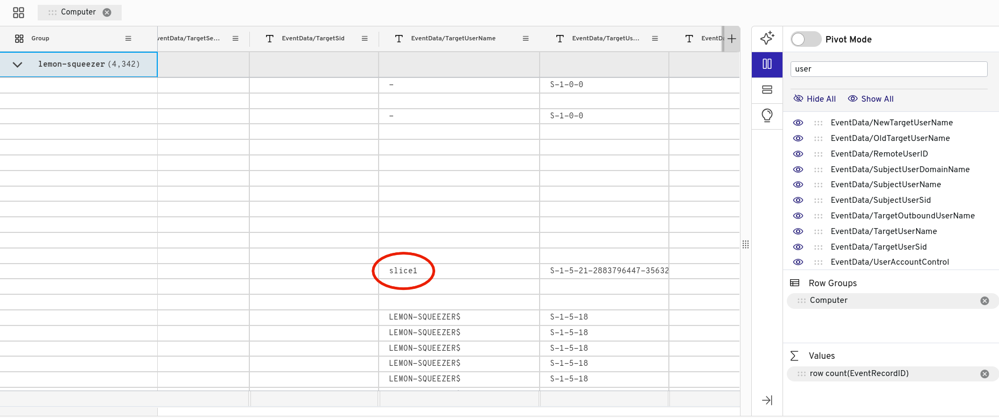
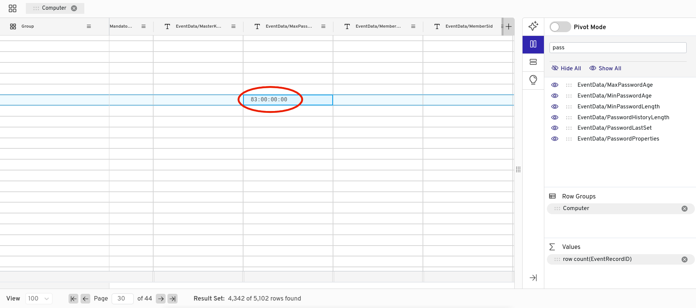

# infiltration

## Description

After successfully infiltrating the lemonthinker gang, we've obtained their current
location - the UK. We've attained some security logs from a gang member's PC, but need some help in
answering information relating to these.

<code>nc be.ax 32222</code>

## Attachments

[security-logs.evtx](attachments/security-logs.evtx)

## Solution (Unfinished)

- Running the command <code>file security-logs.evtx</code> indicates that this file is a
"MS Windows Vista Event Log." After looking into ways to read this file, I settled on
[Gigasheet](https://www.gigasheet.com), an online datasheet viewer.

- After uploading the event log to Gigasheet, I ran the provided <code>nc</code> command and
was shown this:

```
Hello agent. Thanks for your hard work in the field researching. We'll now ask you 6 questions on
the information you've gathered. I'd like to take this opportunity to remind you that our targets are
located in the United Kingdom, so their timezone is BST (UTC +1). We'd like to confirm what the
username of the main user on the target's computer is. Can you provide this information?
```

- To answer this question, I searched the "EventData/TargetUserName" column. One of the first entries
in this column is "slice1."



- I provided "slice1" as the username to the <code>nc</code> command and
was prompted with the next question:

```
Correct! Excellent work. Now, we'd like the name of the computer, after it was renamed.
Ensure that it is entered in exactly how it is in the logs.
```

- Gigasheet automatically sorted the logs by computer. As you can see in the image above, the
name of this computer is "lemon-squeezer," which was the answer to this question. This was the next
question from the <code>nc</code> command:

```
Correct! Excellent work. I wonder if they'll make any lemonade with that lemon-squeezer...
Great work! In order to prevent their lemons from moulding, the lemonthinkers changed the
maximum password age. What is this value? Please enter it as an integer number in days.
```

- There is a column called "EventData/MaxPasswordAge." I searched this column for entries, and
sure enough, on the 30th page of the log file, the value "83:00:00:00" can be seen in this column.



- I provided "83" as my answer to this question and was prompted with the next one:

```
Correct! Excellent work. It seems that our targets are incredibly smart, and turned off
the antivirus. At what time did this happen? Give your answer as a UNIX timestamp.
```

- This is where I got stuck. I started by looking up event IDs that might correspond to the
antivirus being disabled. [This site](https://learn.microsoft.com/en-us/defender-endpoint/troubleshoot-microsoft-defender-antivirus)
lists event IDs associated with Microsoft Defender Antivirus. It seems that event IDs in the 5000 range would be relevant, but I was not able to find any event
IDs like this within the provided log file.
