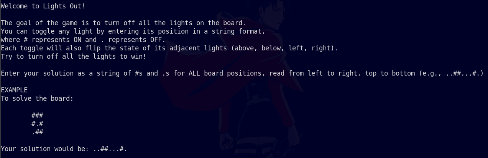

# lights-out

## Description

You know the game. Solve the board quickly before a new one is generated.

<code>nc be.ax 32421</code>

## Attachments

[lights_out.py](attachments/lights_out.py)

## Solution

- Running the provided <code>nc</code> command prompts us with this:

- We are then given a board to write a solution for. The provided board is much larger than
the example board, and the source code in <code>lights_out.py</code> indicates that we have
10 seconds to write the solution. Figuring out the solution by hand is clearly not feasible.

- The source code uses the <code>get_solution()</code> function to make sure that the generated
lights out board is solvable. If we can somehow obtain the results of <code>get_solution()</code>
for the provided board, we can solve it quickly and obtain the flag.

- I wrote my own [Python script](solver.py) to solve a lights out board and return the solution to the user.
I started by copying the <code>get_solution()</code> function from the source code and all of its
dependencies. I then created the [board.txt](board.txt) file to hold the lights out board that the <code>nc</code>
command provides. My script reads each line from the board and converts it into the format
used in the source code. Finally, I determine the solution to the board with <code>get_solution()</code>, convert it to 
the correct format, and use [pyperclip](https://pypi.org/project/pyperclip/) to copy the result to my clipboard immediately.

- Now, I just needed to run the <code>nc</code> command, copy the provided board into <code>board.txt</code>, run
my script, and paste the answer back into the <code>nc</code> interface. I had to move quickly
through these steps to beat the 10 second timer, but when I did, I was able to provide the correct answer and reveal the flag.

## Flag

corctf{freshman_math_class_throwback}
